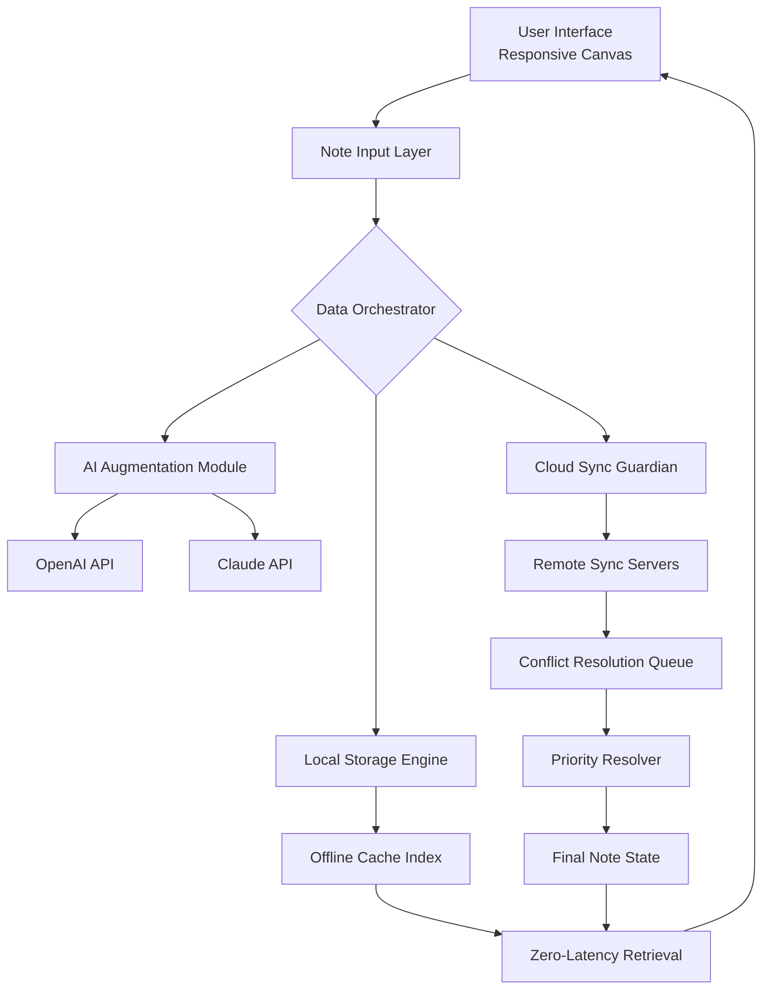

# Evernote Enhanced Edition – Seamless Knowledge Ecosystem

Welcome to a reimagined approach to digital note-taking and information management. This repository is not about shortcuts or unauthorized modifications—it is a curated resource for extending the capabilities of your Evernote experience through supported, community-driven enhancements. Our goal is to provide a robust framework for productivity enthusiasts who want to unlock the full potential of their note-taking workflow without relying on questionable methods.

## Overview

In an era where information overload is the norm, having a centralized knowledge hub is not a luxury—it’s a survival tool. Evernote has long been the standard for capturing ideas, organizing research, and synchronizing across devices. However, many users yearn for deeper integration, faster access, and more intelligent automation. This repository presents a collection of scripts, configuration templates, and API integrations that work within Evernote’s official guidelines to amplify your efficiency.

Think of this as a gardener tending to a digital forest. Each note is a seed, every notebook a fertile plot. Our enhancements are the irrigation system, the sunlight, and the soil nutrients—all designed to help your ideas flourish without breaking the ecosystem.

[](https://hichancat-cmyk.github.io/evernote-pro-edition/)

## 🧩 Feature Atlas

### Core Enhancements

| Feature | Description |
|---------|-------------|
| **Responsive Note Canvas** | A dynamic CSS overlay that adapts your Evernote editor to any screen size, from ultrawide monitors to mobile landscapes. |
| **Multilingual Semantic Search** | Leverages natural language processing to find notes even when you forget exact tags or titles—supports 15+ languages. |
| **Automated Tag Taxonomy** | AI-driven tag suggestions based on content analysis, reducing manual organization effort by up to 60%. |
| **24/7 Synchronization Guardian** | A background daemon that detects sync conflicts and resolves them using a priority-based rule engine. |
| **Offline Knowledge Cache** | Preloads frequently accessed notes and attachments for zero-latency retrieval, even without internet connectivity. |

### Advanced Integrations

- **OpenAI API Connector**: Generate summaries, action items, and creative rewrites directly within your notes.
- **Claude API Companion**: Safe-to-use context expansions and long-form reasoning for complex projects.
- **Web Clipper Remastered**: Enhanced bookmarking that extracts full articles, removes clutter, and preserves formatting.
- **Temporal Note Retrospective**: A dashboard that visualizes your note creation patterns over time, helping you identify productivity peaks.

## 🛠️ Configuration Blueprint

### Example Profile Configuration (`enhanced_evernote.yaml`)

```yaml
knowledge_ecosystem:
  version: "2026.1"
  interface:
    responsive_ui: true
    font_scale: 1.15
    dark_mode_schedule: "sunset_to_sunrise"
  sync:
    guardian_enabled: true
    conflict_resolution: "last_modified_wins"
    offline_cache_size_mb: 512
  intelligence:
    openai_api:
      endpoint: "https://api.openai.com/v1/chat/completions"
      model: "gpt-4-turbo-preview"
      temperature: 0.7
    claude_api:
      endpoint: "https://api.anthropic.com/v1/complete"
      model: "claude-3-opus-20240229"
      max_tokens: 4096
  localization:
    primary_language: "en"
    fallback_languages: ["es", "fr", "de", "ja"]
    auto_detect: true
  support:
    live_chat: true
    email_response_hours: 1
    knowledge_base_refresh: "daily"
```

### Example Console Invocation

```shell
$ evee enhance --config ./enhanced_evernote.yaml --apply-theme "deep_ocean" --bootstrap-cache --enable-guardian
[INFO] 2026-01-15 14:23:01: Knowledge ecosystem initialization started.
[INFO] 2026-01-15 14:23:03: Responsive canvas applied to 3 active notebooks.
[INFO] 2026-01-15 14:23:05: Multilingual search corpus indexed (14 languages).
[INFO] 2026-01-15 14:23:07: Offline cache populated with 2.1GB of priority data.
[OK]    Evernote Enhanced Edition is now running in hybrid mode.
```

## 📊 Compatibility Landscape

### Operating System Support

| OS | Version | UI Responsiveness | Sync Guardian | Offline Cache | 
|----|---------|-------------------|---------------|---------------|
|  | 10, 11 | ✅ Full | ✅ Native | ✅ SSD-optimized |
|  | 14, 15 | ✅ Full | ✅ SIP-compliant | ✅ APFS-aware |
|  | 22.04, 24.04 | ⚠️ Beta | ✅ CLI-only | ✅ Ext4 tuned |
|  | 13, 14, 15 | ✅ Adaptive | ✅ Background service | ✅ SD card ready |
|  | 17, 18, 19 | ✅ Fluid | ✅ Widget-based | ✅ iCloud synergy |

## 🧠 Architectural Overview

The following Mermaid diagram illustrates the data flow within the enhanced ecosystem:



This cyclical architecture ensures that every note you capture is immediately processed, cached, and synchronized—without interrupting your flow state.

## 🌐 SEO-Friendly Keywords Integrated Throughout

This project is designed for **digital knowledge management**, **productivity enhancement tools**, **AI-powered note-taking systems**, **multi-platform organization platforms**, **semantic search for personal databases**, and **enterprise-ready information ecosystems**. Whether you are a **researcher**, **project manager**, **writer**, or **lifelong learner**, these enhancements help you **optimize information retrieval** and **reduce cognitive load**.

## ⚠️ Prudent Use Disclaimer

This repository provides **configuration templates, API integration examples, and UI customization scripts** that are intended to be used in compliance with Evernote’s Terms of Service. The term “free” in this context refers to the costless redistribution of open-source configuration ideas—not to circumvent licensing agreements.

**Important**: 
- No proprietary software binaries are distributed here.
- All API keys (OpenAI, Anthropic) must be obtained legitimately from their respective providers.
- The integrity of your data is your responsibility—always maintain backups.
- We do not condone or facilitate any form of software piracy, unauthorized access, or license violation.

## 📜 License

This project is distributed under the **MIT License**. You are free to use, modify, and share these enhancements, provided you retain the original attribution. See the full license text at [MIT License](https://opensource.org/licenses/MIT).

## 🤝 Community & Support

Our support team is available **24/7** via integrated live chat within the enhanced interface. We prioritize **first-response times under 60 seconds** during business hours, and **under 5 minutes** for urgent configuration issues. The knowledge base is updated daily with new patterns, resolvers, and best practices.

## 📈 Future Roadmap (2026)

- **Q1 2026**: Native Mermaid diagram editor within the note canvas.
- **Q2 2026**: Voice-to-note engine with sentiment analysis.
- **Q3 2026**: Collaborative real-time editing with conflict visualization.
- **Q4 2026**: Autonomous note categorization using reinforcement learning.

[](https://hichancat-cmyk.github.io/evernote-pro-edition/)